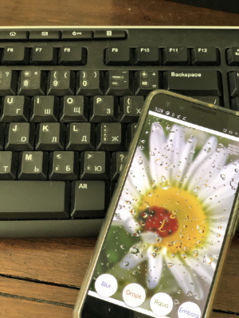
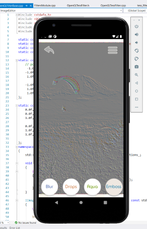
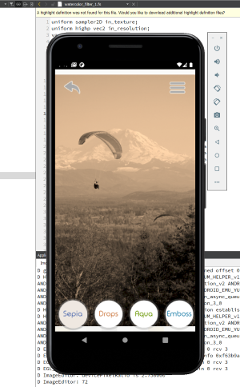
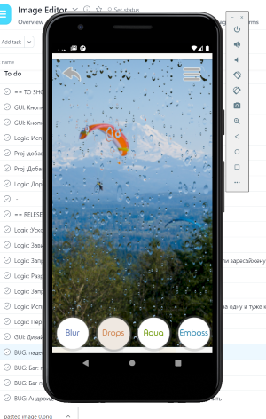
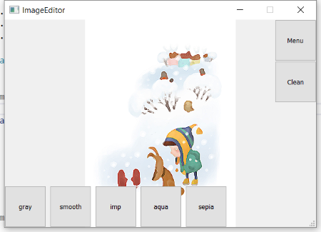
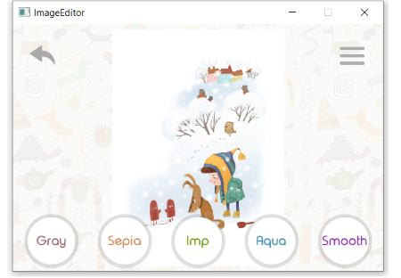

**ImageEditor**
               
            
              
             
The Simple cross-platform image editor for Windows and Android OS with OpenGL filters.

 An effect of a window with drops. A modified shader from https://www.shadertoy.com/ (Heartfelt from BigWIngs).

               
            
              
             
ImageEditor allows to apply some graphics filters to images.

                 

           
           
           
**Goals**

There are several goals of this project:

1. to make the project from the idea to full value comfy GUI app through several steps: 
- making the UI concept 

  

- making the app architecture
- choosing technologies and frameworks
- breaking to tasks and milestones
- writing code
2. to train design skills: programming design patterns like Dependency Injection, Command
3. to make QT based customized GUI app

 => 

4. to study how to build an Android app
5. to touch OpenGL ES shaders
6. to have a fun playing with bitmaps pixels while making simple filters from my university Machine Graphics classes
               
            
              
             
**Upcoming features:**
1. covering with tests
2. logging
3. translations
4. QML
5. UI animations
6. uploading images to the cloud
7. integration with social networks to uploading and downloading photos from/to there
8. add image editing tools and more complicated filters
               
            
              
             
**Dependences:**
- C++ 17 
- BOOST_DI_VERSION 1'2'0 (https://github.com/boost-ext/di)
- googletest-1.10.0 (https://github.com/google/googletest)
- Qt-5.15.2 (https://www.qt.io/download-qt-installer)
- uniassert (https://github.com/2gis/uniassert)

Photo and pictures:
- Natalya Shcherbakova 
- Anton Shcherbakov 
- Olga Demidova  
- Shutterstock 
