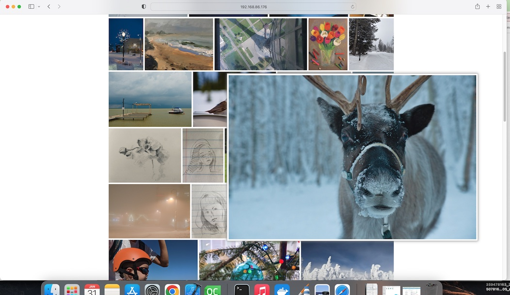
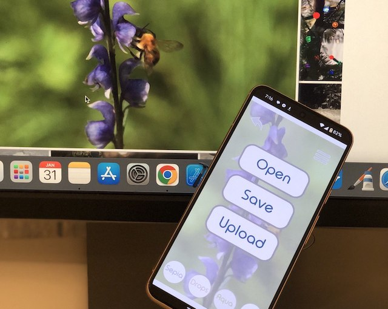

# ImageEditor
               
            
              
             
A Simple client/server cross-platform image editor application for **Windows**, **Android OS**, **Mac**, and **iOS** with **OpenGL** filters.

 *An effect of a window with drops.*

***

 *An image server page.* 

***

 *An image uploading to the server.* 

***
                        
             
**ImageEditor** allows to apply some graphics filters to images.

.

*Emboss, sepia and a window with drops (a modified shader from BigWIngs https://www.shadertoy.com/) effects.*

***
           
           
## Goals

There are several goals of this project:

1. to make the project from an idea to a full value comfy GUI app through several steps: 
- making the UI concept 

  

- making an app architecture
- choosing technologies and frameworks
- breaking to tasks and milestones
- writing a code
2. to train design skills: programming design patterns like Dependency Injection, Command
3. to make a **QT** based customized GUI app

 -> 

4. to study how to build an Android app
5. to touch OpenGL ES shaders
6. to have a fun playing with bitmaps pixels while making simple filters from my university Machine Graphics classes
7. to play with Jankins
8. to explore testing and logging libraries
               
            
***

             
## Upcoming features:
1. covering with tests
2. logging
3. translations
4. QML
5. UI animations
6. uploading images to the cloud
7. integration with social networks to uploading and downloading photos from/to there
8. add image editing tools and more complicated filters
               

***
              
             
**Dependences:**
- C++ 17 
- BOOST_DI_VERSION 1'2'0 (https://github.com/boost-ext/di)
- googletest-1.10.0 (https://github.com/google/googletest)
- spdlog (https://github.com/gabime/spdlog)
- Qt-6.4.2 (https://www.qt.io/download-qt-installer)
- uniassert (https://github.com/2gis/uniassert)

**Photo and pictures:**
- Natalya Shcherbakova 
- Anton Shcherbakov 
- Olga Demidova  
- Shutterstock 
