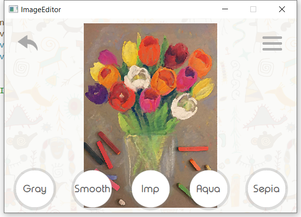
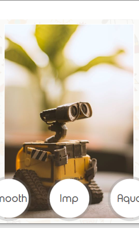
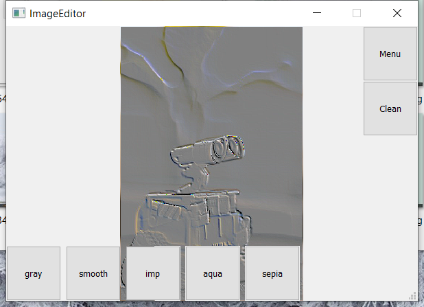
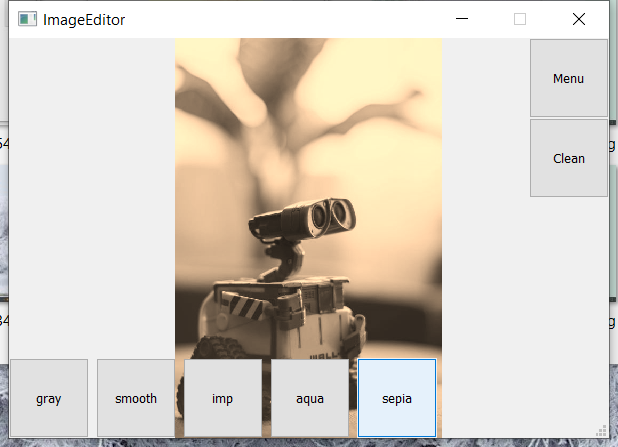
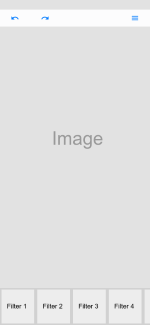
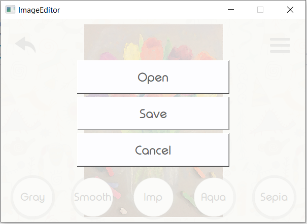
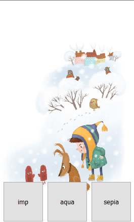
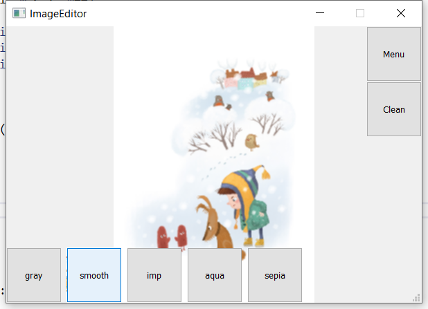
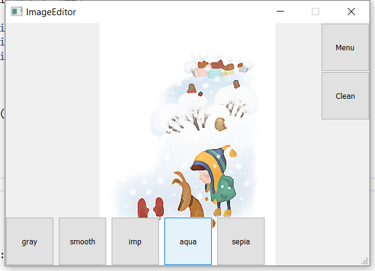

ImageEditor

Simple cross-platform image editor. 

ImageEditor allows to apply some graphics filters to images.

  

 

There are several goals of this project:

1. to make project from idea to full value comfy GUI app through several steps: 
- making UI concept 
  
- making app architecture
- choosing technologies and frameworks
- breaking to tasks and milestones
- making code
2. to train design skills: programming design patterns like Dependency Injection, Command
3. to make QT based customized GUI
4. to have a fun playing with bitmaps pixels while making simple filters from my university Machine Graphics classes

  

Upcoming features:
1. compile to android
2. covering with tests
3. logging
4. translations
5. QML
6. UI animations
7. uploading images to cloud
8. integration with social networks to uploading and downloading photos
9. add image editing tools and more complexed filters like Old Style Photo

Dependences:
- C++ 17 
- BOOST_DI_VERSION 1'2'0 (https://github.com/boost-ext/di)
- googletest-1.10.0 (https://github.com/google/googletest)
- Qt-5.15.2 (https://www.qt.io/download-qt-installer)
- uniassert (https://github.com/2gis/uniassert)
